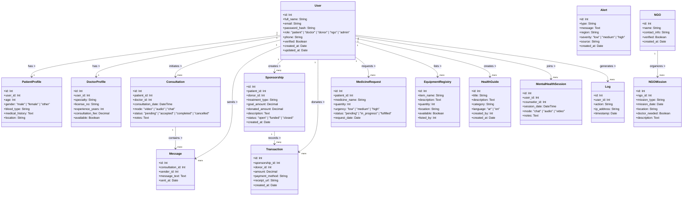

```mermaid

classDiagram

%% ==============
%% MAIN ENTITIES
%% ==============

class User {
    +id: Int
    +full_name: String
    +email: String
    +password_hash: String
    +role: "patient" | "doctor" | "donor" | "ngo" | "admin"
    +phone: String
    +verified: Boolean
    +created_at: Date
    +updated_at: Date
}

class PatientProfile {
    +id: Int
    +user_id: Int
    +age: Int
    +gender: "male" | "female" | "other"
    +blood_type: String
    +medical_history: Text
    +location: String
}

class DoctorProfile {
    +id: Int
    +user_id: Int
    +specialty: String
    +license_no: String
    +experience_years: Int
    +consultation_fee: Decimal
    +available: Boolean
}

class Consultation {
    +id: Int
    +patient_id: Int
    +doctor_id: Int
    +consultation_date: DateTime
    +mode: "video" | "audio" | "chat"
    +status: "pending" | "accepted" | "completed" | "cancelled"
    +notes: Text
}

class Message {
    +id: Int
    +consultation_id: Int
    +sender_id: Int
    +message_text: Text
    +sent_at: Date
}

class Sponsorship {
    +id: Int
    +patient_id: Int
    +donor_id: Int
    +treatment_type: String
    +goal_amount: Decimal
    +donated_amount: Decimal
    +description: Text
    +status: "open" | "funded" | "closed"
    +created_at: Date
}

class Transaction {
    +id: Int
    +sponsorship_id: Int
    +donor_id: Int
    +amount: Decimal
    +payment_method: String
    +receipt_url: String
    +created_at: Date
}

class MedicineRequest {
    +id: Int
    +patient_id: Int
    +medicine_name: String
    +quantity: Int
    +urgency: "low" | "medium" | "high"
    +status: "pending" | "in_progress" | "fulfilled"
    +request_date: Date
}

class EquipmentRegistry {
    +id: Int
    +item_name: String
    +description: Text
    +quantity: Int
    +location: String
    +available: Boolean
    +listed_by: Int
}

class HealthGuide {
    +id: Int
    +title: String
    +description: Text
    +category: String
    +language: "ar" | "en"
    +created_by: Int
    +created_at: Date
}

class Alert {
    +id: Int
    +type: String
    +message: Text
    +region: String
    +severity: "low" | "medium" | "high"
    +source: String
    +created_at: Date
}

class MentalHealthSession {
    +id: Int
    +user_id: Int
    +counselor_id: Int
    +session_date: DateTime
    +mode: "chat" | "audio" | "video"
    +notes: Text
}

class NGO {
    +id: Int
    +name: String
    +contact_info: String
    +verified: Boolean
    +created_at: Date
}

class NGOMission {
    +id: Int
    +ngo_id: Int
    +mission_type: String
    +mission_date: Date
    +location: String
    +doctor_needed: Boolean
    +description: Text
}

class Log {
    +id: Int
    +user_id: Int
    +action: String
    +ip_address: String
    +timestamp: Date
}

%% =====================
%% RELATIONSHIPS
%% =====================

User "1" --> "1" PatientProfile : has >
User "1" --> "1" DoctorProfile : has >
User "1" --> "many" Consultation : initiates >
User "1" --> "many" Message : sends >
User "1" --> "many" Sponsorship : creates >
User "1" --> "many" Transaction : donates >
User "1" --> "many" MedicineRequest : requests >
User "1" --> "many" EquipmentRegistry : lists >
User "1" --> "many" HealthGuide : creates >
User "1" --> "many" MentalHealthSession : joins >
User "1" --> "many" Log : generates >

Consultation "1" --> "many" Message : contains >
Sponsorship "1" --> "many" Transaction : records >
NGO "1" --> "many" NGOMission : organizes >


```